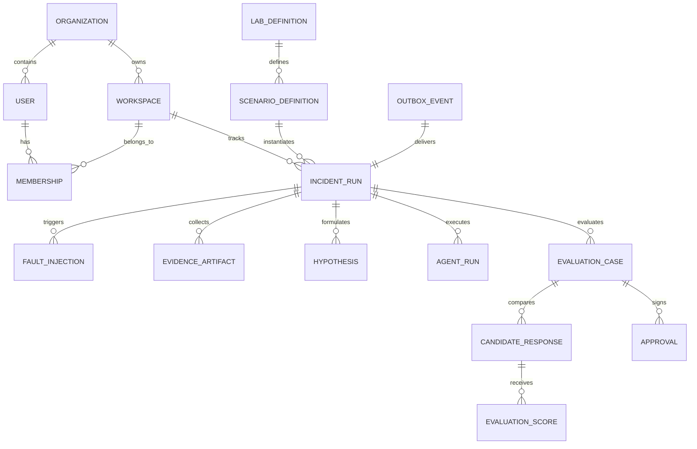
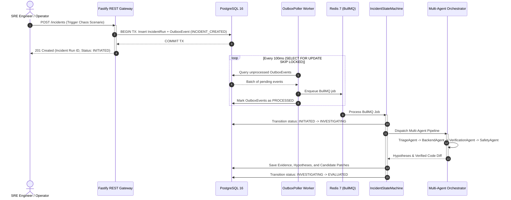
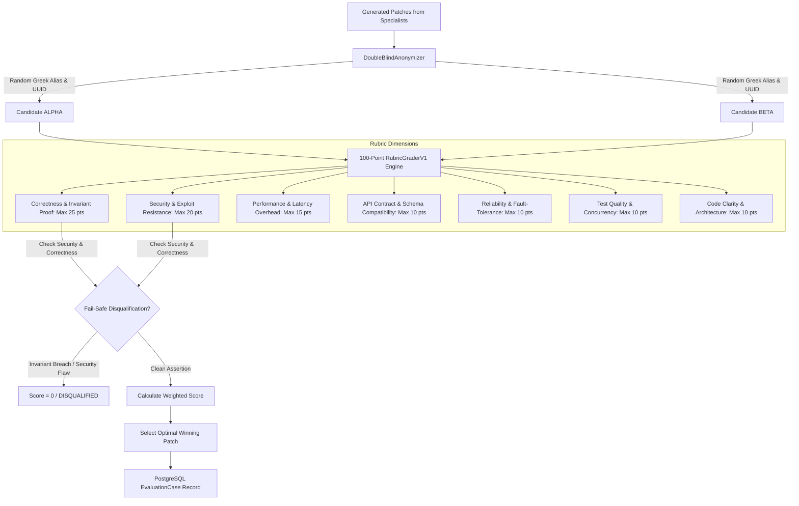

# FaultForge AI — Technical Architecture & Domain Specification

This document details the architectural principles, data flow pipelines, transactional boundaries, and reliability guarantees of the **FaultForge AI** platform.

---

## 1. Domain Entities & Database Model

FaultForge AI utilizes a strictly normalized PostgreSQL 16 schema managed via Prisma ORM:

---

## 2. Transactional Outbox Pattern & Background Orchestration

To eliminate dual-write hazards between PostgreSQL and Redis/BullMQ, state transitions write to the `outbox_events` table within the same ACID database transaction:

---

## 3. Double-Blind Adjudication & Rubric Architecture

---

## 4. Human Approval & Progressive Canary Deployment

1. **Human Approval Gate**:
   - Four-Eyes Principle: Reviewer $\neq$ Author.
   - Enforces `Permission.PATCH_APPROVE`.
   - Transitions `EVALUATED` $\rightarrow$ `APPROVED`.

2. **Canary Deployment Simulator**:
   - **Step 1 (5% Traffic)**: Telemetry evaluation (Error rate $\le 0.5\%$, $P95 \le 50\text{ms}$).
   - **Step 2 (25% Traffic)**: Telemetry evaluation.
   - **Step 3 (50% Traffic)**: Telemetry evaluation.
   - **Step 4 (100% Traffic)**: Full promotion $\rightarrow$ `RESOLVED`.
   - **Automated Instant Rollback**: If any step breaches threshold $\rightarrow$ Instant state restore & `ROLLED_BACK`.

---

## 5. Security Architecture & RFC Standards

- **RFC 7636**: PKCE OAuth2/OIDC Authorization Code flow with SHA-256 code challenge.
- **RFC 7807**: Problem Details for HTTP APIs error response formatting.
- **W3C TraceContext**: OpenTelemetry distributed traceparent propagation (`00-{traceId}-{spanId}-{flags}`).
- **Least Privilege Principle**: All production containers execute under unprivileged `USER node`.
